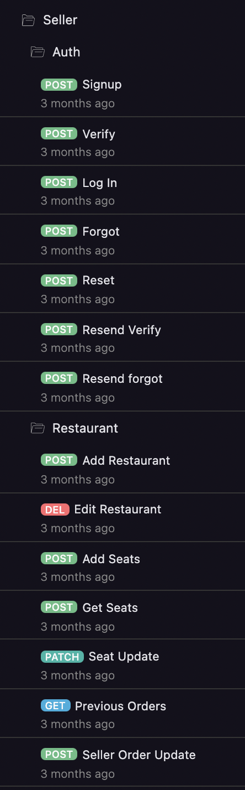

# Inspirathon 2021

This was my and my teams first Hackathon in October 2021 at Don Bosko College of Engineering Goa. 
Me along with Akash Sanjeev and Sachin Padwalkar had participated as a team, where I was working on Django application (Backend), Saching was handling React application (Frontend) and Akash was handling Androind application (Frontend).

We were working on Restaurant Seat Booking Management System.
We build an android application for customers to book seats in the Restaurant, and a react based web application for restaurant owners to manage bookings.

## Authors

- [Atharva Parkhe](https://www.linkedin.com/in/atharva-parkhe-3283b2202/)  -  Django Developer (Backend)  -  *Python*

- [Sachin Padwalkar](https://www.linkedin.com/in/sachin-padwalkar-a265291ba/)  -  ReactJS Developer (Frontend)  -  *JavaScript*

- [Akash Sanjeev](https://www.linkedin.com/in/akash-sanjeev-37436a1b5/) -  Android Developer (Frontend)  -  *Java*
## Tech Stack

**Backend:** Django

**Frontend:** React, Android
## API Reference

Import the *endpoints.json* file in Thunder-Client (VS Code).
All the Wbdpoints are saved in a proper folder structure.

- Endpoints for Customer Section

- Endpoints for Restaurant Owner (Seller) Section

